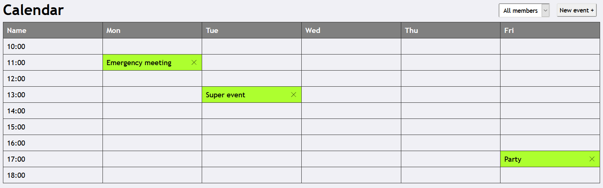
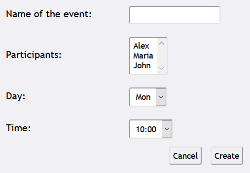
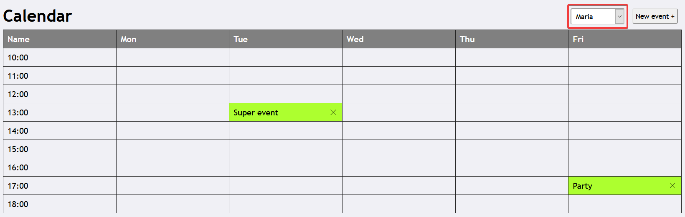
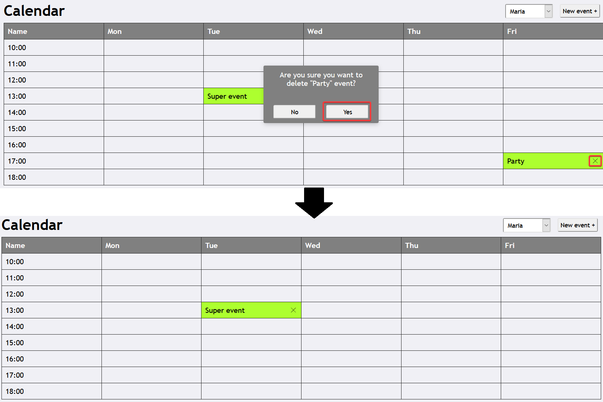

# CalendarAPP &mdash; meeting planning calendar for a meeting room in your office
## Usage documentation:

### ***Calendar screen*** &mdash; page, where you can see all meetings scheduled for the meeting room filtered by person.

***
### 1. In order to create new meeting you should click ***New Event+*** button in the upper right corner, after that you would be transferred to ***Create event screen***.

### ***Create event screen*** &mdash; page, where you can create a new event for meeting room.

***
### To create event successfully you should perform the following steps:
1. fill the *event name* field;
2. choose at least one participant (you can choose more then one participant by holding ctrl button and clicking them);
3. choose a day of event;
4. choose a time for this day (the time slot for event day must be free);
5. press ***Create*** button.

### After successful creation of an event, you would be transferred back to the ***Calendar screen***.
***
### 2. To filter events you can choose required person on the left of ***New Event+*** button.

***
### 3. In order to delete a meeting you have to click the delete icon near the meeting title and then confirm this action in a confirmation dialog.
